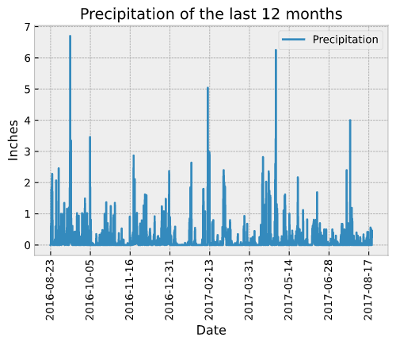
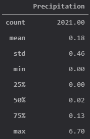
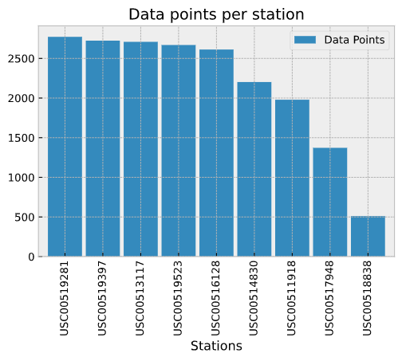
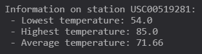
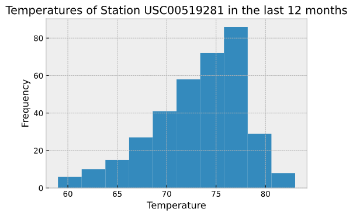
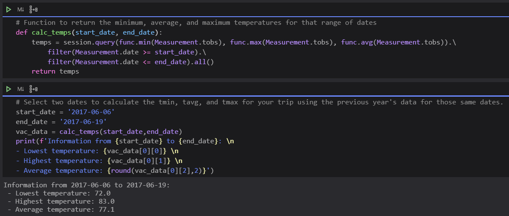
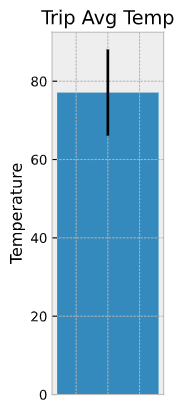
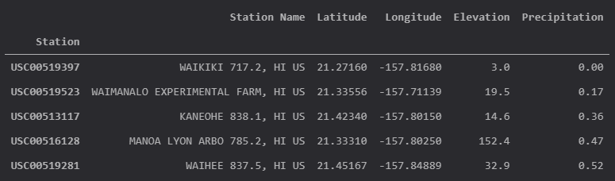
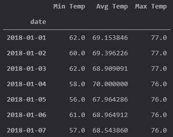
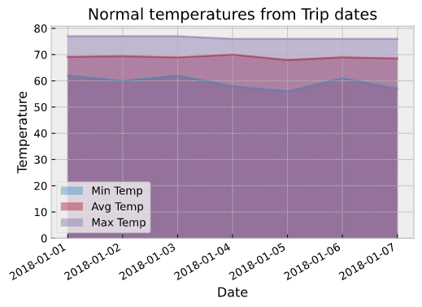

# SQLAlchemy Exercise - Weather in Hawaii

This exercise is a climate analysis on the Honolulu area.

## Data

The dataset can be found [here](hawaii.sqlite) and it contains 2 tables, called Measurements and Stations. This SQLite file contains information from 2010-01-01 to 2017-08-23 for 9 stations.

### Objective

* Analize the last 12 months of precipitation data.
  * Plot data.
  * Describe it.
* Analize the stations information.
  * List of stations with data points.
  * Information about the most active station.
  * Plot histogram with data from the most active station.
* Vacation exploration.
  * Generate function to retrive min, max and average temperatures from vacation start and end dates.
  * Plot results
  * Generate table with station information from last year vacation dates.
  * Calculate the daily normals of the trip with min, mean, and max temperature.
  * Plot results
* Create an API endpoint to call some of the previous queries.

## Results

* Analize the last 12 months of precipitation data.
  * Plot data.

    

  * Describe it.

    

* Analize the stations information.
  * List of stations with data points.

    

  * Information about the most active station.

    

  * Plot histogram with data from the most active station.

    

* Vacation exploration.
  * Generate function to retrive min, max and average temperatures from vacation start and end dates.

    

  * Plot results

    

  * Generate table with station information from last year vacation dates.

    

  * Calculate the daily normals of the trip with min, mean, and max temperature.

    

  * Plot results

    

* Create an API endpoint to call some of the previous queries.

  

### Copyright

View of Honolulu, image retrived from Royal Hawaiian Movers on 07/13/2020.
